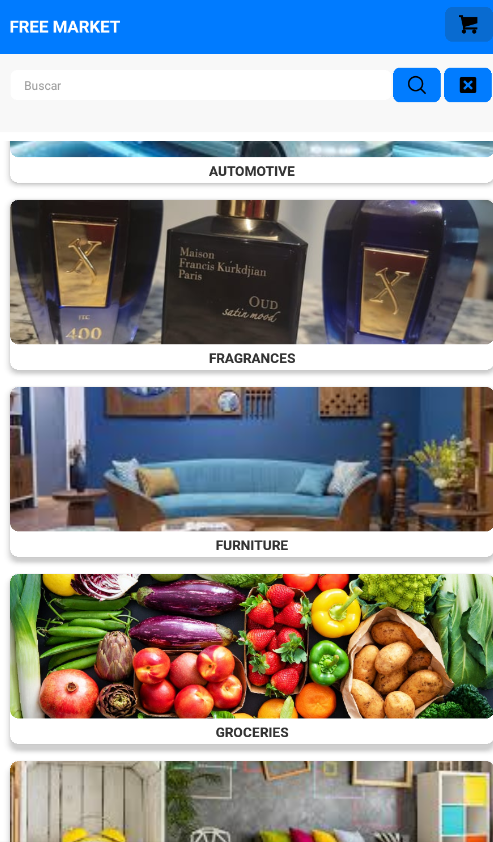

# Free Market App - Aplicación de Comercio Electrónico en React Native

**Free Market App** es una aplicación de comercio electrónico desarrollada con React Native, diseñada con una interfaz moderna, intuitiva y fácil de usar. La aplicación proporciona una experiencia de compra en línea fluida y segura, utilizando tecnologías de vanguardia para garantizar un rendimiento excelente y una experiencia de usuario excepcional.

---

## Características

### Pantalla de Login

La pantalla de inicio de sesión se basa en el sistema de autenticación de **Firebase**, lo que garantiza un acceso seguro para los usuarios. Solo aquellos que estén autenticados pueden ingresar y realizar compras. Este sistema permite tanto el inicio de sesión como el registro de usuarios de manera eficiente y segura.

### Pantalla de Categorías

La pantalla de categorías presenta las distintas secciones del E-Commerce de forma dinámica. Las categorías pueden actualizarse en cualquier momento, permitiendo una gestión flexible. Cada categoría redirige a una lista de productos específicos dentro de la misma.

### Pantalla de Productos

Muestra los productos organizados por categoría. Al seleccionar un producto, los usuarios pueden acceder a una vista detallada del mismo y, si lo desean, añadirlo al carrito de compras.

### Detalle del Producto

En la vista de detalle del producto, los usuarios pueden visualizar información adicional sobre el artículo. La funcionalidad de agregar uno o más productos al carrito está disponible, permitiendo que el usuario ajuste la cantidad mediante un campo de entrada. Además, se garantiza que no se pueda agregar más productos de los disponibles en inventario.

### Pantalla de Carrito

En esta pantalla, los usuarios pueden ver los productos añadidos a su carrito. Si se agrega un producto ya presente, se actualizará automáticamente la cantidad. El total del carrito se recalcula en tiempo real, y el usuario tiene la opción de eliminar productos. Al finalizar la compra, el usuario puede proceder a crear una orden con los artículos seleccionados.

### Pantalla de Órdenes

Aquí se muestra el historial de órdenes del usuario, con su fecha y el total de la compra. Al hacer clic en el botón de "Ver más", los usuarios pueden revisar todos los detalles de la orden.

### Pantalla de Perfil

La sección de perfil permite a los usuarios personalizar su experiencia. Ofrece dos opciones principales:

- **Agregar Imagen de Perfil:** Utiliza `expo-image-picker` para permitir que los usuarios elijan una foto desde la cámara o la galería.
- **Agregar Localización:** Utiliza la API de `Maps Static` para obtener la latitud y longitud del usuario, y actualizar automáticamente su dirección en la base de datos.

---

### Buscador de Categorias y Productos

El buscador permite a los usuarios encontrar fácilmente productos o categorías dentro de la aplicación. Ofrece dos opciones principales:

- **Buscar por Nombre de Categoría:** Los usuarios pueden ingresar el nombre de una categoría específica para encontrar rápidamente los productos asociados a ella.
- **Buscar por Nombre de Producto:** Utilizando un campo de búsqueda, los usuarios pueden escribir el nombre de un producto y obtener una lista de resultados que coinciden, mejorando la navegación y la experiencia de compra.

---

## Tecnologías Utilizadas

- **Firebase Authentication:** Implementación del sistema de autenticación de Firebase para una gestión de acceso segura.
- **React Native Navigation Stack:** Para gestionar la navegación entre pantallas dentro de la aplicación.
- **React Native Navigation Bottom Tab:** Para gestionar la navegación por pestañas.
- **Expo-Location:** Permite acceder a la ubicación del usuario para obtener su latitud y longitud.
- **Expo-Image-Picker:** Facilita la carga de imágenes de perfil desde la cámara o galería.
- **Redux:** Para la gestión centralizada del estado de la aplicación.
- **RTK Query y Firebase:** Utilizados para realizar operaciones de lectura y escritura en la base de datos en tiempo real.

---

## Instalacion

- **Clona el Repositorio:** git clone https://github.com/SantiWengorra/Proyecto-Final-Desarrollo-de-Aplicaciones-Wengorra.git
- **Instala las dependencias:** npm install
- **Configura las claves de API para servicios externos (Expo-Location, Firebase, etc.)**
- **Configura las credenciales de Firebase en tu proyecto.**
- **Ejecuta la aplicación:** npm start

---

## CONTACTO

- santi.wengorra@gmail.com.
- https://github.com/SantiWengorra
